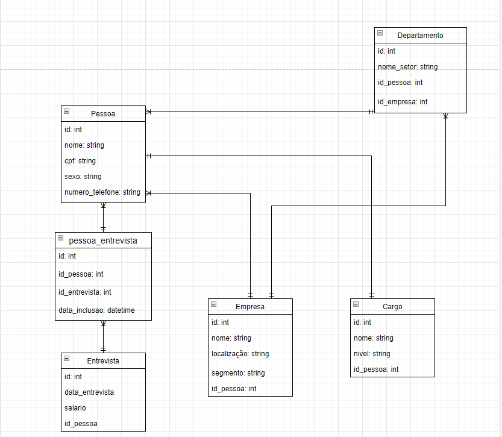

<h1 id="nome-do-projeto" align="center">PROJETO PANDEMIA</h1>

  - [Sobre o projeto](#about)
  - [Modelagem de dados](#data-modeling)
  - 🤖 [Tecnologias](#technologies)
  - 🎊 [Features](#features)
  - 👨‍👨‍👦‍👦 [EQUIPE](#squad)
    

<h2 id="about">📈 Sobre o projeto </h2>
..loading

<h2 id="data-modeling">📋 Modelagem de dados</h2>



<h2 id="technologies">🤖 Tecnologias/Ferrramentas</h2>

- **MYSQL WORKBENCH**
- **MYSQL SERVER**

<h2 id="features">🎊 Tarefas</h2>

- [x] criar estrutura do banco
- [] Geração de gráficos
- [] popular dados no banco
- [] criação do slide
- [] criação dos objetos(views, procedures e etc)

## Como Executar o projeto 

```
clonar repositório
git clone https://github.com/Gabriel-developer-01/mysql-project-database-db_universidade.git

1. Abrir o mysql workbench
2. cipiar o script que está localizado em scripts > bank-structure.sql
3. rodar o script no mysql
```

## 
<h2 id="squad">👨‍👨‍👦‍👦 EQUIPE</h2>

- Gabriel Mendes
- Marcos
- Yuri Leal
- Sergio Capinã

[⬆ Voltar ao topo](#nome-do-projeto)
